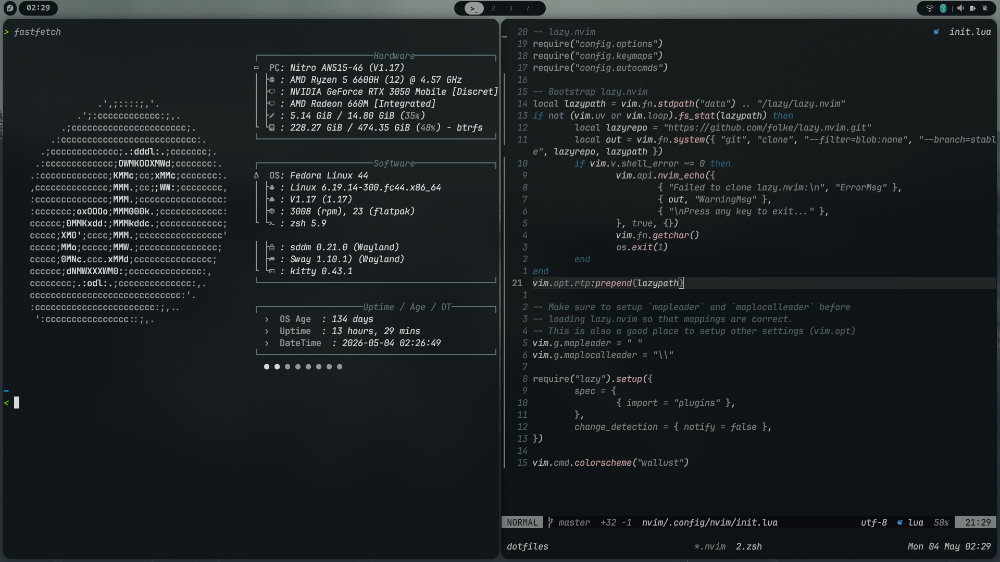
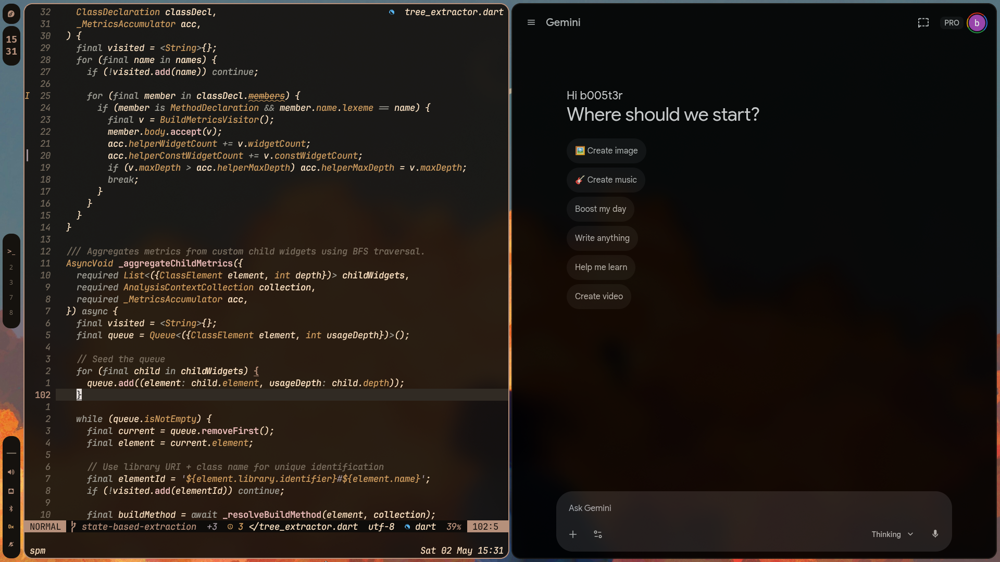

# Alberto's Dotfiles

A highly integrated, dynamically themed Linux environment centered around the **Sway** window manager and **Wallust** for color scheme generation.

---

## Preview

---

## Project Overview

This repository contains personal configuration files managed using **GNU Stow**. The setup is designed for a consistent user experience across terminal and GUI applications, with a strong emphasis on Vim-style keybindings and dynamic aesthetics.

### Key Technologies
- **Window Manager:** [Sway](https://swaywm.org/) (Wayland)
- **Dynamic Theming:** [Wallust](https://github.com/onur/wallust) (Generates colors from wallpapers)
- **Terminal:** [Kitty](https://sw.kovidgoyal.net/kitty/)
- **Shell:** Zsh (with Oh-My-Zsh and Powerlevel10k)
- **Editor:** [Neovim](https://neovim.io/) (LazyVim-based)
- **Multiplexer:** Tmux
- **File Manager:** Yazi
- **Launcher:** Rofi (Wayland fork)

## Quick Start

### Prerequisites
- [GNU Stow](https://www.gnu.org/software/stow/)
- [Wallust](https://github.com/onur/wallust)
- Sway, Kitty, Zsh, Neovim, etc.

## Dynamic Theming

The system uses `wallust` to sync colors across all supported applications. When you pick a new wallpaper, colors are extracted and templates are updated automatically.

### Theme Scripts
Available in `sway/.local/bin/`:
- `appearance-rofi`: Toggle between **Modern** (gaps, floating-style) and **Minimal** (no gaps, clean) looks.
- `wallpaper-picker <path>`: Sets a wallpaper and regenerates the system theme.
- `theme-rofi`: Choose from predefined `wallust` color schemes/palettes.
- `wallpaper-rofi`: A graphical picker for the `wallpapers/` directory.

### Supported Applications
- **Sway:** Borders, focused windows, and status bar colors.
- **Waybar / SwayNC:** Fully themed CSS.
- **Kitty / Tmux:** Terminal colors and status lines.
- **Neovim:** Dynamic colors via `lua/theme/colors.lua`.
- **Rofi:** Launcher and menu aesthetics.
- **Obsidian:** Synced via a CSS snippet.

## Directory Structure

| Directory | Description |
|-----------|-------------|
| `sway/` | Sway WM config, `config.d/` modules, and custom bin scripts. |
| `wallust/` | Templates and configuration for color generation. |
| `nvim/` | Neovim setup using LazyVim. Plugins in `lua/plugins/`. |
| `zsh/` | Zsh config with `ZDOTDIR` redirected to `~/.config/zsh`. |
| `waybar/` | Status bar configuration and styling (Minimal & Modern modes). |
| `rofi/` | Application launcher and menu themes. |
| `kitty/` | Terminal emulator settings and theme integration. |
| `tmux/` | Tmux session management and keybindings (`Ctrl+s` prefix). |
| `yazi/` | Terminal file manager with image preview support. |
| `wallpapers/` | A curated collection of wallpapers for theme generation. |
| `code/` | VS Code settings (vim extension with vim keybindings). |

## Development Conventions

- **XDG Compliance:** All configurations strictly follow the XDG Base Directory Specification.
- **Vim Everywhere:** Neovim keybindings are prioritized in the shell (vi-mode), Tmux, Obsidian, and VS Code.
- **Leader Key:** `Space` is the primary leader key for Neovim and VS Code.
- **Modular Configs:** Sway and Neovim configs are split into logical files/modules for easier maintenance.
